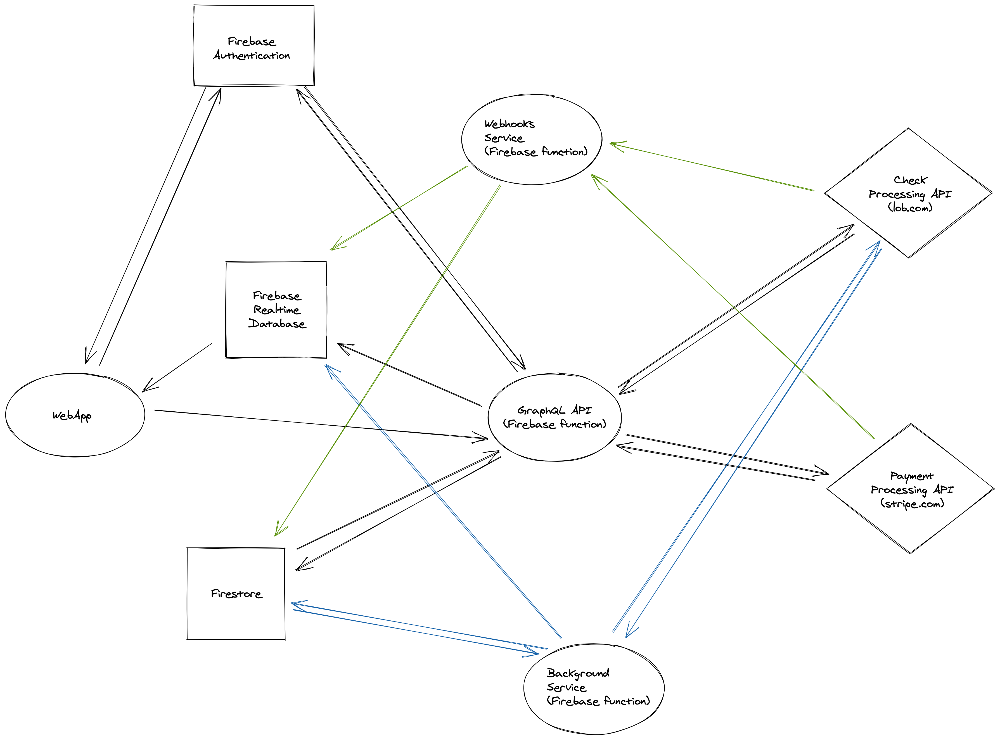

# My Check Supply

**Main website:**: https://check.supply

**App website:** https://my.check.supply

# Overview




# Project Structure

```
/
/functions/
/web/
```

- `root`: firebase settings
- `functions`: backend firebase functions
- `web`: frontend web app

# Tech Stack
## Backend
- Firebase
- nodejs
- typescript
- Apollo Server

## Frontend
- ReactJS
- Ant Design
- Apollo GraphQL
- Redux

# Steps to deploy

1. Build and deploy functions
```
cd functions
yarn build
firebase deploy --only functions
```

2. Build and deploy frontend
```
cd web
yarn build
firebase deploy --only hosting
```

# Running locally
1. Backend:
```
cd functions
yarn build
firebase emulators:start --only functions
```

2. Frontend
```
cd web
yarn start
```
# Troubleshooting

If you run the emulators and get a "This port is already used" error:
```
yarn global add kill-port
kill-port <port-to-kill>
```

# Notes:
```
export FIREBASE_AUTH_EMULATOR_HOST="localhost:9099"
```